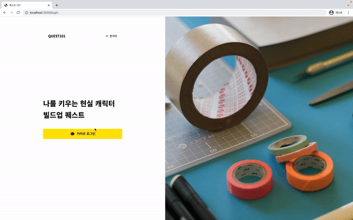
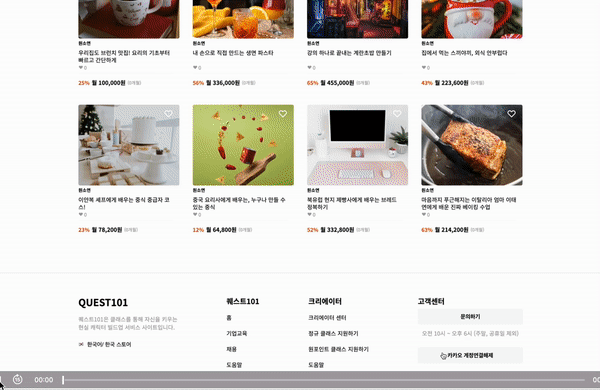
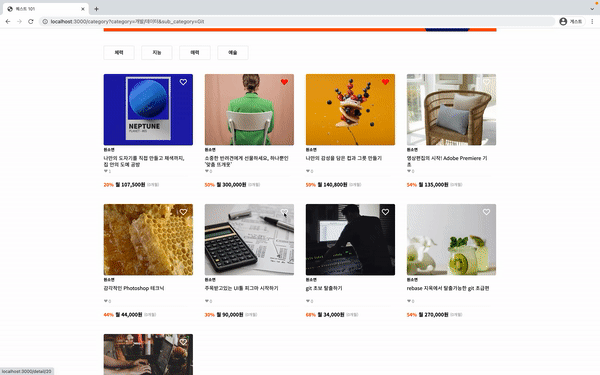
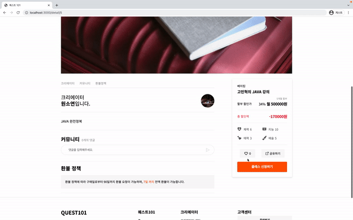
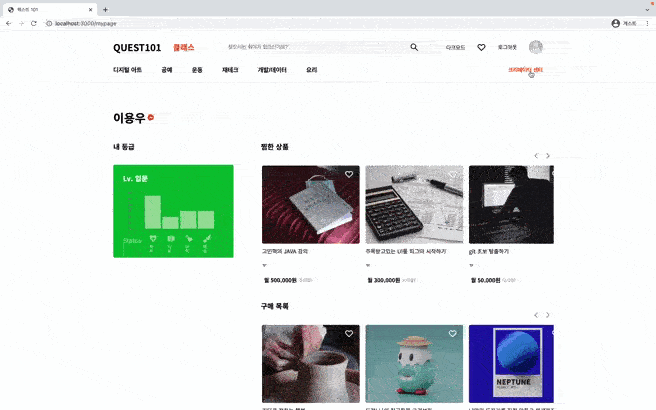

# **Quest 101 프로젝트**

## 🎉 프로젝트 소개

클래스 101를 모티브한 프로젝트입니다. 

<b>퀘스트 101</b> 은 기존의 클래스 101과 같이 온라인 클래스 플랫폼과 같지만 클래스를 통해 자신을 키우는 현실 캐릭터 빌드업 서비스를 추가로 제공합니다.

온라인 클래스 수강을 통해 자신의 역량이 빌드업되는 것을 차트를 통해 시각적으로 확인이 가능합니다.

 
 

## 📆 개발 인원 및 기간

---

### 개발기간 (총 11일)

- 2021/12/13~2021/12/24

### 프론트엔드 개발자(3명)

- [이용우](https://github.com/moolbum)
- [원소연](https://github.com/dnjstd)
- [정소영](https://github.com/sozeroJung)

### 백엔드 개발자(3명)

- [박정현](https://github.com/haileyjpark)
- [이재문](https://github.com/jaemoon406)
- [이태연](https://github.com/whytili89)
   
   
   

### 🕹 적용 기술 및 구현 기능 적용 기술 

`Front-End` : JavaScript, React.js, StyleComponent, React-router-dom 
`라이브러리` : slick, chart.js, react-hook-form, drag 
`Back-End` : Django, Python, MySQL, 미니콘다 
`Common` : Git, Github, Slack, Trello, Notion 

 
 
 

## 👟 담당페이지

### 원소연

- 리스트 페이지 좋아요 기능
- 리스트 페이지 스텟 필터링
- 리스트 페이지 슬라이드 라이브러리 (slick)
- nav query string

### 이용우

- 상세 페이지 좋아요 기능
- 상세 페이지 댓글
- 마이페이지 슬라이드
- 마이페이지 차트 라이브러리 (chart.js)

### 정소영

- 카카오 로그인 API
- 크리에이터 페이지 폼 데이터 통신 (react-hook-form, drag)

## 영상

### 로그인

### 좋아요

### 디테일

### 폼

